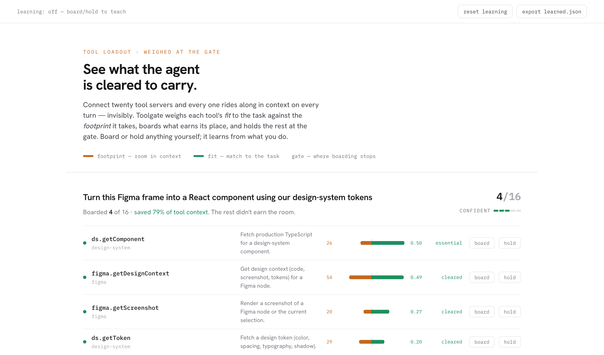

# Toolgate

**See what an agent is cleared to carry, and change it.** Toolgate is a small layer inside the agent harness, between the agent and its pile of connected tools. Before the agent starts a task, it weighs each tool's *fit* against the *footprint* it takes in context, boards the ones that earn their place, and holds the rest at the gate. You can see every call, overrule any of it in one gesture, and it learns from what you do.



> A design study, built as a working prototype. It came out of a real itch: I run about 20 tool servers in my daily agent setup, and every turn drags a few hundred tool definitions into context whether the task needs them or not. I couldn't see that decision and couldn't steer it. Toolgate treats it as a human–agent interaction problem, not just an engineering one.

## Try it

```bash
npm run demo     # score the sample tasks -> panel/decisions.json
npm run panel    # serve http://127.0.0.1:7799 to explore them
npm run learn    # watch a held tool learn to board itself after feedback
```

Score a single task from the command line:

```bash
node src/demo.mjs "summarize the design-critique slack channel and post a recap"
node src/demo.mjs "turn this figma frame into a react component" --pin ds.getComponent
```

## The problem

Connect a handful of tool servers to an agent (MCP, plugins, whatever) and three things quietly go wrong:

1. **Context bloat.** Every tool's schema rides along in the prompt on every turn. Twenty servers can mean a few hundred definitions competing with your actual task for the model's attention.
2. **It's invisible.** The agent never tells you which tools it's carrying, or why. You find out only when it does something you didn't expect, or misses something you did.
3. **You can't steer it.** There's no "always bring this one" or "never touch that" short of editing config files and restarting.

The usual fixes are blunt. Load everything and you get the bloat and the risk. Hand-curate static profiles and they're rigid, plus you maintain them forever.

## The job to be done

> **When** I hand an agent a task that might need external tools,
> **I want** to trust it's carrying the right small set, and to see and adjust that choice,
> **so I can** keep it fast, focused, and in bounds without babysitting or editing config.

Which means: see the shortlist and the reasoning before work starts, understand the tradeoff being made, correct it in one gesture when I disagree, and know when the agent isn't sure so I can lean in right then.

## How it works

Every tool earns its place through one legible tradeoff:

| Term | Meaning |
|------|---------|
| **fit** | how well the tool matches the task (0 to 1) |
| **footprint** | the room it takes in context: its schema size, bumped up for slow or sensitive tools |
| **worth** | `fit − (λ × normalized footprint)`. Is it pulling its weight? |

Toolgate ranks tools best-fit first and keeps boarding while each is still worth it. When the next one isn't, it draws the **gate line** and stops. A relevance floor keeps cheap-but-irrelevant tools from sneaking in just because they're small. Then it reports how confident it is: if the last tool boarded and the first tool held are nearly tied, it says so and widens the set rather than faking certainty.

### How many to load: a learned, cost-aware stop

A ranking tells you the *order* of tools, not *how many* to take, and a score threshold picks the cutoff badly once tools cost different amounts of context — a cheap useless tool and an expensive essential one can't be split by a score line. So the stop is **learned**, not a fixed floor.

This is the part I'm most pleased with. At each candidate depth Toolgate computes the payoff `sufficiency − λ·Σcost` and the *gap* `Δ` between stopping now and the best it could still do by continuing. The sign of `Δ` is the stop label; its magnitude `|Δ|+ε` (ε=1e-4) weights each error by the payoff at stake — so a mistake that costs a lot of payoff matters more than one that barely moves the needle. A regret-weighted, ℓ2-regularized logistic model learns to stop from ten deployment-visible features (marginal score-cost and prefix-progress signals, never the answer key), and the gate is tuned on validation payoff. `src/stoppolicy.mjs:features` documents the mapping; a regret-identity check runs at train time (`max|err|=0`) to confirm the training target and the payoff stay in sync.

**Trained and evaluated on real tasks, not synthetic ones.** `npm run mine` mines my actual agent history (Claude Code + opencode), `npm run label` recovers each task's required-tool set `G_x` (LLM judge, primary; consumption heuristic, cross-check), and `npm run train-stop` trains the stop on a held-out split. On 126 mined tasks (candidates scoped per task to the servers it touched, ~18 on average; real schema-token costs → heterogeneous), against the deployable baselines:

| λ (cost pressure) | learned stop | score threshold | score-per-cost | full access | oracle |
|---|:---:|:---:|:---:|:---:|:---:|
| 0.12 | **0.288** (52% suff) | 0.240 | 0.240 | −1.48 | 0.466 |
| 0.20 | 0.217 | 0.240 | 0.240 | −3.14 | 0.389 |

(mean test payoff, higher is better). At moderate pressure the learned stop clearly wins: the score-only baselines collapse to acquiring *nothing* — once tools cost different amounts, a single score line can't separate a cheap-useless tool from an expensive-essential one — while the learned stop acquires ~2 tools and doubles sufficiency. Under high pressure with Toolgate's weak lexical ranker, acquiring the *right* tools is hard, so it slightly over-acquires and trails the trivial "take nothing" line — an honest limit that tracks the ranker, not the stop rule (it clears comfortably on the synthetic `--synthetic` regime with clean scores). See [`docs/03-eval.md`](docs/03-eval.md) for the mining/labeling methodology and caveats.

### It learns from you

Board a tool it held, or hold one it boarded, and Toolgate remembers. Under the hood that's a LinUCB contextual bandit: one small linear model per tool over the words in the task, trained on your board (reward 1) and hold (reward 0) choices. I used a bandit rather than a hand-rolled heuristic because it's the standard answer for learning to shortlist from thumbs-up/thumbs-down feedback: it handles cold start, needs few examples, stays readable, and its uncertainty term feeds the same "unsure, so widen" behavior above. Keep boarding a tool for a kind of task and it starts clearing the gate on its own. `npm run learn` shows exactly that.

## The panel

The panel is the heart of the project. Each task shows its tools ranked, fit against footprint as a balance (green earns its place, amber is what it costs), the gate line with everything held below it, a confidence meter, and live **board** / **hold** toggles that re-weigh the manifest and teach the learner in front of you. It's deliberately light and restrained: Hanken Grotesk with IBM Plex Mono, a green/amber pair that means something, and none of the indigo-gradient, centered-hero defaults most AI-built UIs land on.

## Architecture

Agent runners load their tool list once at startup and don't reliably refresh it mid-session, so you can't swap tools in and out on the fly. Toolgate works around that by shipping as a **broker**: an MCP server that exposes only two tools. The agent registers only Toolgate, calls `find_tools(task)` to get the shortlist, then `run_tool(...)` to use anything on it. `run_tool` forwards to the real downstream server through the MCP SDK's client, so the call actually executes. The visible tool list just stays two tools wide, and the decision (and the call) happen inside, where they can be seen, logged, and overruled.

The catalog isn't hand-written. `npm run catalog` reads your opencode MCP config, connects to each server, and builds the tool list from what they actually advertise (into `config/catalog.generated.json`, which the broker and demo prefer over the bundled sample).

```
src/ranker.mjs      the shortlist engine (fit x footprint -> worth -> gate line)
src/stoppolicy.mjs  learned cost-aware stop (regret-weighted logistic over prefixes)
src/mine-history.mjs   CLI: mine real tasks from Claude Code + opencode history
src/label-required.mjs CLI: recover each task's required set G_x (LLM judge + heuristic)
src/eval-dataset.mjs   turn labeled tasks into ranked {scores,costs,requiredMask} tuples
src/train-stop.mjs  CLI: train the stop on real history (or --synthetic) + baselines
src/learner.mjs     LinUCB contextual bandit; learns from board/hold feedback
src/text.mjs        shared tokenizer so the ranker and learner agree on features
src/broker.mjs      the MCP server: find_tools + run_tool
src/mcpConfig.mjs   reads your opencode MCP config (source of truth for servers)
src/mcpClients.mjs  SDK client pool that forwards run_tool to the real servers
src/gen-catalog.mjs CLI: build the catalog from your servers' live tools/list
src/prefs.mjs       load/save the learned bandit state
src/demo.mjs        CLI: run tasks, write a decision record for the panel
src/learn.mjs       CLI: watch a held tool learn to board itself
panel/index.html    the legibility and control UI (zero build, served locally)
config/             sample catalog + the policy (lambda, floors, weights)
eval/history/       mined + labeled real tasks (gitignored — private session text)
docs/               the case study: 01-problem, 02-design, 03-eval
```

## Connect it to opencode

```bash
npm install @modelcontextprotocol/sdk   # once
npm run catalog                          # build the catalog from your servers
```

Add the broker to `~/.config/opencode/opencode.json`:

```json
{
  "mcp": {
    "toolgate": { "type": "local", "command": ["node", "/absolute/path/to/toolgate/src/broker.mjs"], "enabled": true }
  }
}
```

To actually shrink context, run an agent that carries only Toolgate instead of every server: add an `agent` whose `tools` disable your other MCP prefixes and keep `toolgate*`, then tell it to call `find_tools(task)` before reaching for tools. `run_tool` handles the rest. (Any MCP client works the same way — Codex, Gemini CLI, Claude Code — the config key is just named differently.)

## Limitations

The default fit score is plain lexical matching so the repo runs with zero setup. It misses synonyms ("design files" doesn't match a Figma tool), and that shows up in the eval. Swapping in real embeddings is a one-function change. Confidence measures how clean the gate cut was, not whether fit got the answer, so it can be confidently wrong. That's exactly why board/hold and the learner are first-class. The stop policy is trained on synthetic labeled tasks (required sets known offline); on a real, annotated task set it would be calibrated the same way, but the numbers above come from the synthetic set. Catalog generation also depends on each server being reachable at build time; ones that need an app running or interactive auth are skipped with a warning. [`docs/03-eval.md`](docs/03-eval.md) has the numbers, the failure cases, and what I'd do next.

## Read more

- [`docs/01-problem.md`](docs/01-problem.md) — the problem, and why it's a design problem
- [`docs/02-design.md`](docs/02-design.md) — the decision, the learner, the interface, the broker
- [`docs/03-eval.md`](docs/03-eval.md) — ten tasks, honest results, and the dials

A working prototype, not production infrastructure. Built to think through a real human–agent interaction problem end to end: from the pain, to the job, to a steerable, legible design.
